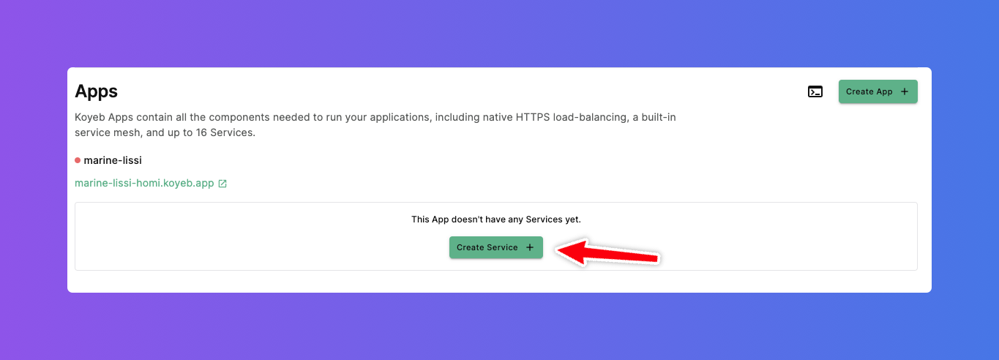
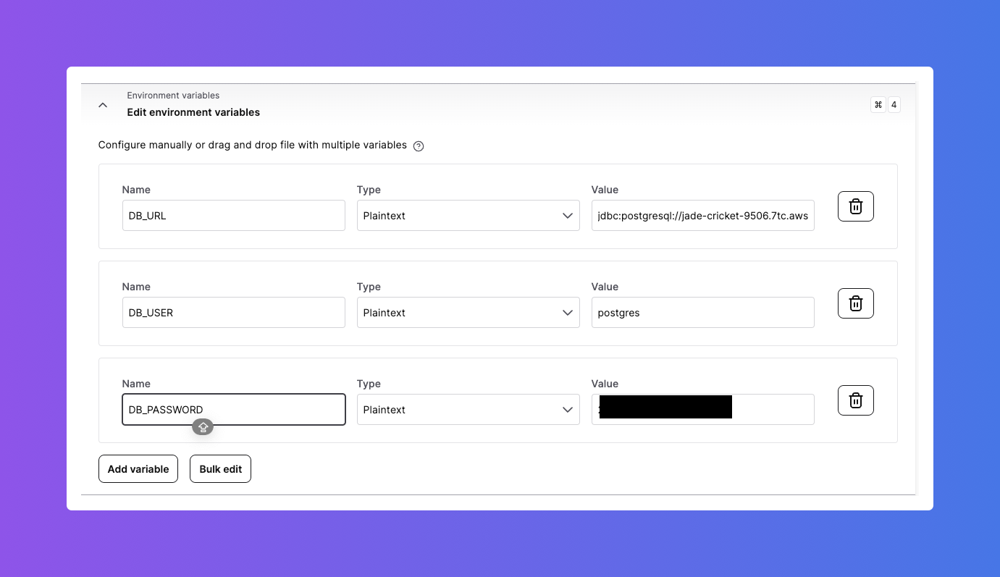
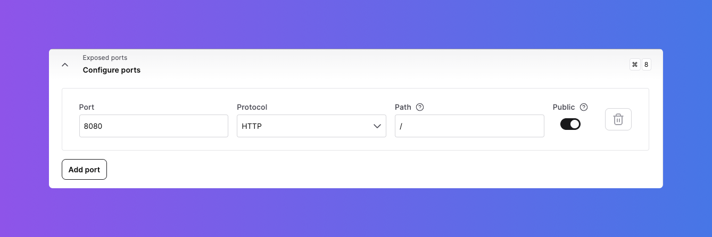
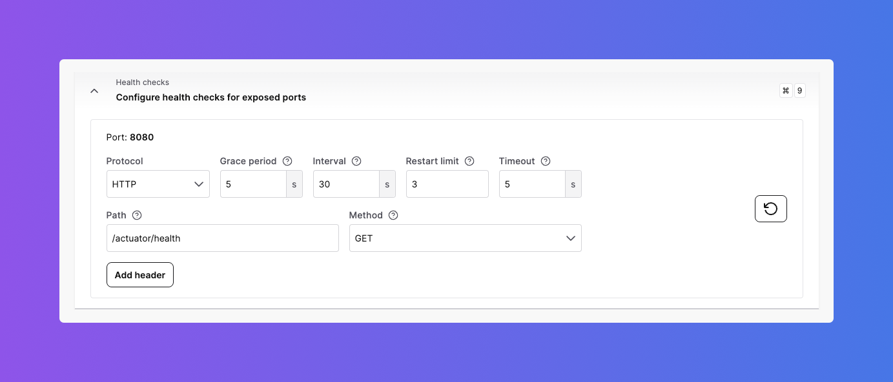

# Install PostgreSQL


In the previous article, the CockroachDB cluster was created and the `employee` table was created in the `default` database.
In this article, a DB2Rest instance running on Koyeb will be used to connect to CockroachDB instance.
Refer to the article on how to [deploy DB2Rest on Koyeb cloud](http://localhost:3000/docs/koyeb/run_db2rest_as_koyeb_webservice).

## Configure Koyeb App Service

Now in order to connect the DB2Rest instance to CockroachDB -
the CockroachDB database URL, user and password should be used. On the Koyeb Apps dashboard click on `Create Service +` button.




Now the follow the steps as outlined in [deploy DB2Rest on Koyeb cloud](http://localhost:3000/docs/koyeb/run_db2rest_as_koyeb_webservice)
to configure the service in the application.

### Configure Environment Variables

Add the environment variables as shown below

- DB_URL=`jdbc:postgresql://jade-cricket-9506.7tc.aws-eu-central-1.cockroachlabs.cloud:26257/defaultdb?sslmode=verify-full`
- DB_USER=`postgres`
- DB_PASSWORD=`<GENERATED PASSWORD>`




### Configure Exposed Port

Set the exposed port to `8080`




### Configure Health Checks

Finally, configure health checks to point to the actuator URL as shown below.



Now click on the `Deploy` button to deploy the service.

## Test DB2Rest App Service

Once the deployment is successfully completed, it is time to test the application service.


### Check DB2Rest Health

It is very easy to verify DB2Rest application service with the actuator endpoint as shown below:


import Tabs from '@theme/Tabs';
import TabItem from '@theme/TabItem';

<Tabs>
    <TabItem value="cURL" label="cURL" default>
        ```bash

        curl --request GET \
        --url 'https://marine-lissi-homi.koyeb.app/actuator/health?=' \
        --header 'User-Agent: insomnia/8.6.1'


        ```
    </TabItem>
    <TabItem value="httpie" label="HTTPie">
        ```bash

        http GET 'https://marine-lissi-homi.koyeb.app/actuator/health?=' \
        User-Agent:insomnia/8.6.1

        ```
    </TabItem>

</Tabs>


The actuator health check service in DB2Rest will return the following response:


```http
HTTP/1.1 200
Content-Type: application/json
Transfer-Encoding: chunked

{
	"status": "UP"
}

```

The `status` attribute shows that the application service is ready to handle database operations.


### Insert Row

<Tabs>
    <TabItem value="cURL" label="cURL" default>
        ```bash

        curl --request POST \
        --url https://marine-lissi-homi.koyeb.app/employee \
        --header 'Content-Type: application/json' \
        --header 'User-Agent: insomnia/8.6.1' \
        --data '{
        "first_name" : "Salman",
        "last_name" : "Khan",
        "email" : "sk@skfilms.com",
        "created_on" : "2015-04-14T11:07:36.639Z"
    }'


        ```
    </TabItem>
    <TabItem value="httpie" label="HTTPie">
        ```bash

        echo '{

        "first_name" : "Salman",
        "last_name" : "Khan",
        "email" : "sk@skfilms.com",
        "created_on" : "2015-04-14T11:07:36.639Z"

    }' |  \
        http POST https://marine-lissi-homi.koyeb.app/employee \
        Content-Type:application/json \
        User-Agent:insomnia/8.6.1
        ```
    </TabItem>

</Tabs>

#### HTTP Response
```json lines
{
	"row": 1,
	"keys": {
		"id": 1
	}
}

```

### Read Row


<Tabs>
    <TabItem value="cURL" label="cURL" default>
        ```bash

        curl --request GET \
        --url https://marine-lissi-homi.koyeb.app/employee \
        --header 'User-Agent: insomnia/8.6.1'

        ```
    </TabItem>
    <TabItem value="httpie" label="HTTPie">
        ```bash

        http GET https://marine-lissi-homi.koyeb.app/employee \
        User-Agent:insomnia/8.6.1

        ```
    </TabItem>

</Tabs>

#### HTTP Response
```json lines
[
	{
		"id": 1,
		"first_name": "Salman",
		"last_name": "Khan",
		"email": "sk@skfilms.com",
		"created_on": "2015-04-14T11:07:36.639+00:00"
	}
]

```

Finally, refer to the DB2Rest documentation for further learning and exploring API features.

For help, visit us on [Discord](https://discord.gg/fEFnNmUq) or our [GitHub Discussions](https://github.com/9tigerio/db2rest/discussions)
