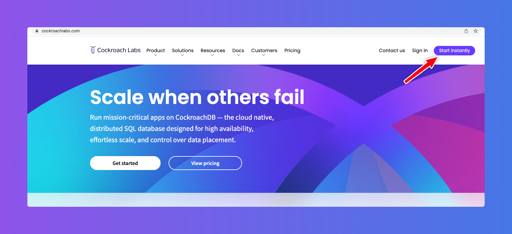
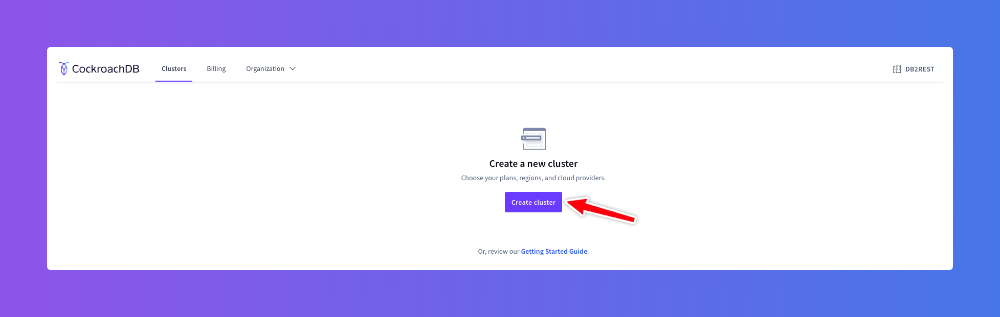
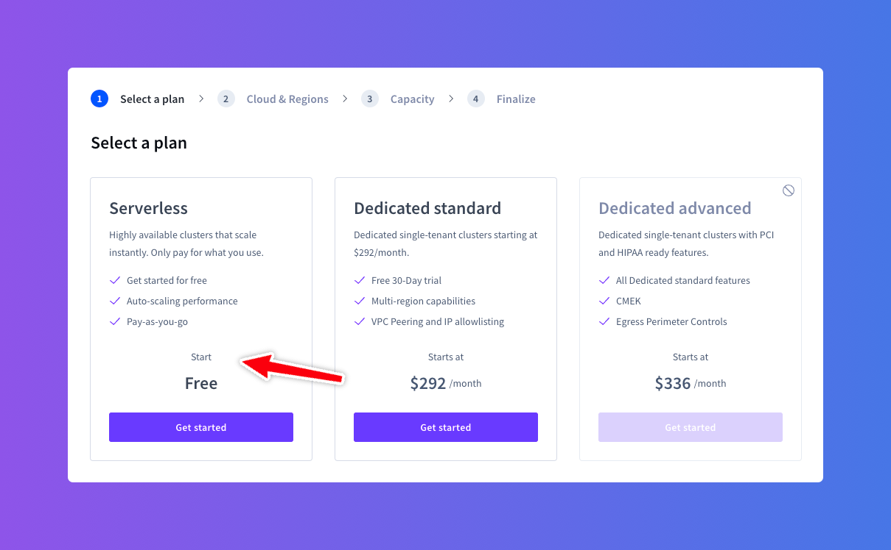
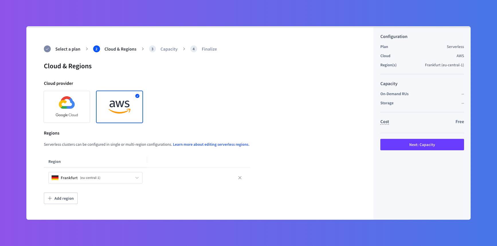
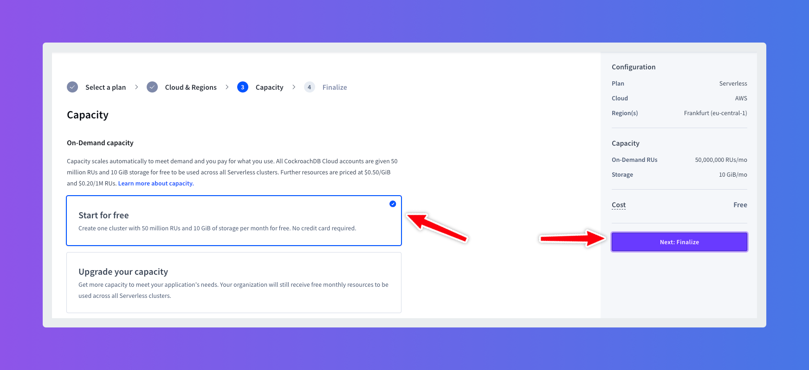
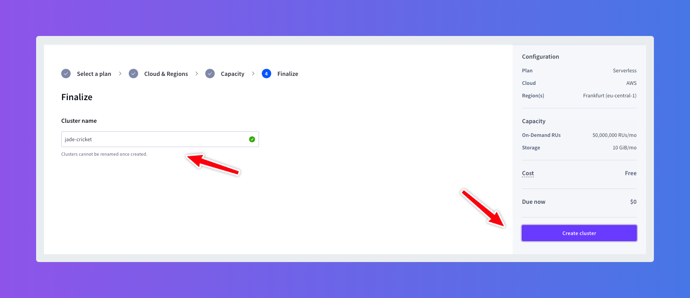
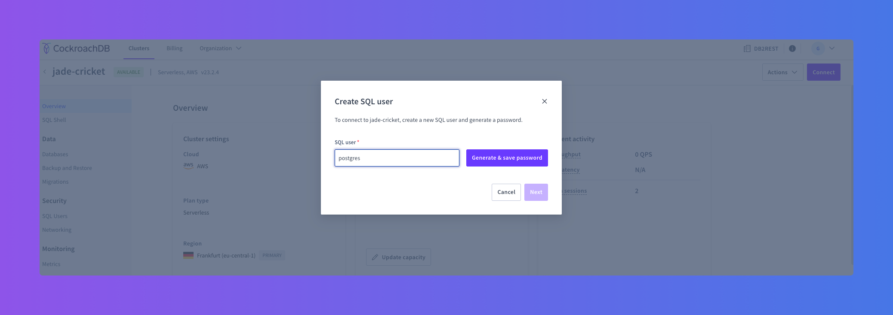
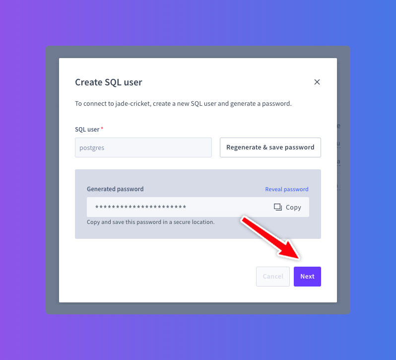
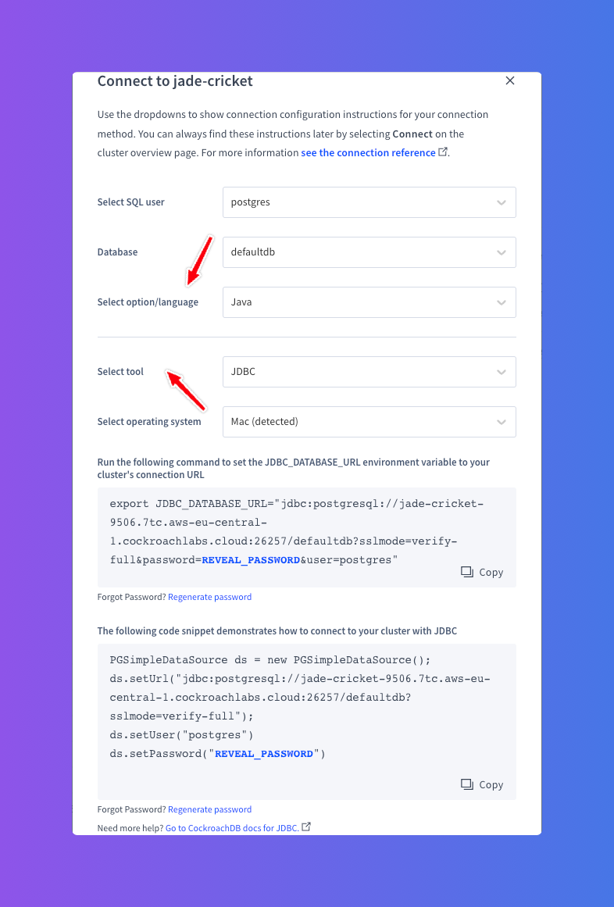
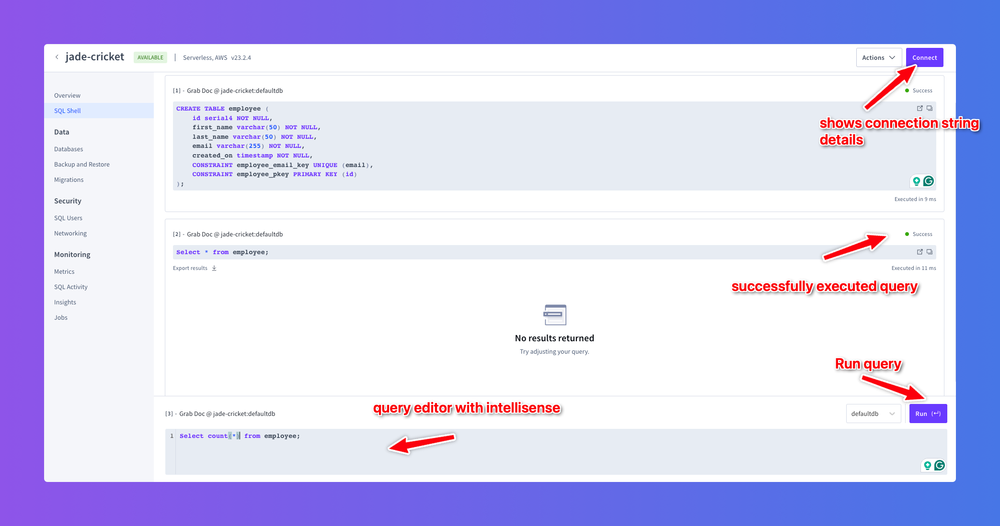

# Create CockroachDB Cluster


## What is CockroachDB?

CockroachDB is a distributed SQL database built on a transactional and strongly-consistent key-value store.
It scales horizontally; survives disk, machine, rack, and even datacenter failures with minimal latency disruption and no manual intervention;
supports strongly-consistent ACID transactions; and provides a familiar SQL API for structuring, manipulating, and querying data.

### Open Source

CockroachDB is open source available on [Github](https://github.com/cockroachdb/cockroach).

### Cockroach Cloud

However, CockroachLabs the company behind CockroachDB also provides a managed cloud service for CockroachDB.
The service is available at (https://www.cockroachlabs.com). It is possible to signup to the service from the home page of CockroachLabs.



## Create Database

After login to CockroachDB cloud, the dashboard is shown. Now click on the `Create cluster` button as shown below:




### Select a Plan

In the plan selection page select the `Free Plan`. However, feel free to select a plan that suits your needs.



### Select a Region

In the next step, select `AWS` as cloud provider. Change the region to `Frankfurt`. This will allow it to be connected from [DB2Rest
deployed on Koyeb](https://db2rest.com/docs/koyeb/run_db2rest_as_koyeb_webservice). The DB2Rest service staying close to the database
region will provide better performance.



Then click on `Next Capacity` button to select the compute power.

### Select Capacity



Select either the `Start for free` option to get started. Then click on `Next: Finalize` button.


### Finalize

Finally, click on the `Create cluster` button to provision the CockroachDB cluster.



### User and Password

Within a few seconds the database is ready and a new popup opens up to create a database user and generate password.



Click on `Generate & save password`. Once the password is generated, copy and save it in a secure store. Then click `Next`.



### Connection Details

Finally, the CockroachDB connection details are shown.



Note down the JDBC Connection URL, database user and password (created in the previous step) as these will be used to set-up
DB2Rest instance. Finally click on `Close` button.


## Connect to CockroachDB

Now connect to CockroachDB using a tool like [Dbeaver](https://dbeaver.io/). PostGreSQL JDBC driver can be used to connect to CockroachDB


### Create Table

Once successfully connected, create a table using the script below.


```SQL

CREATE TABLE employee (
	id serial4 NOT NULL,
	first_name varchar(50) NOT NULL,
	last_name varchar(50) NOT NULL,
	email varchar(255) NOT NULL,
	created_on timestamp NOT NULL,
	CONSTRAINT employee_email_key UNIQUE (email),
	CONSTRAINT employee_pkey PRIMARY KEY (id)
);

```

### Using SQL Shell

It is also possible to run the SQL statement using the experimental SQL shell provided in the CockroachDB database dashboard.




