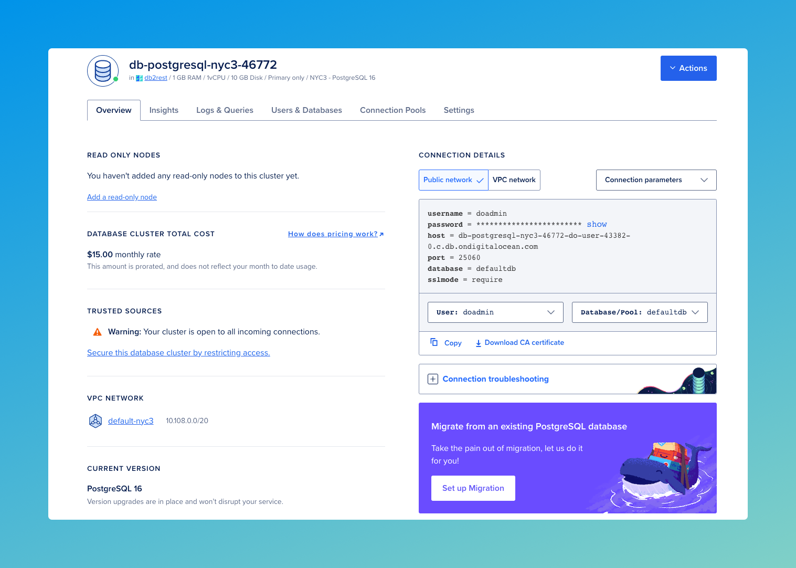
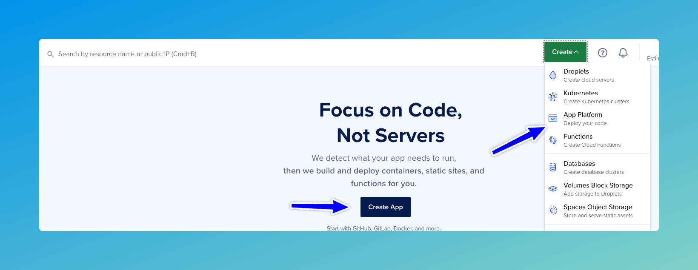
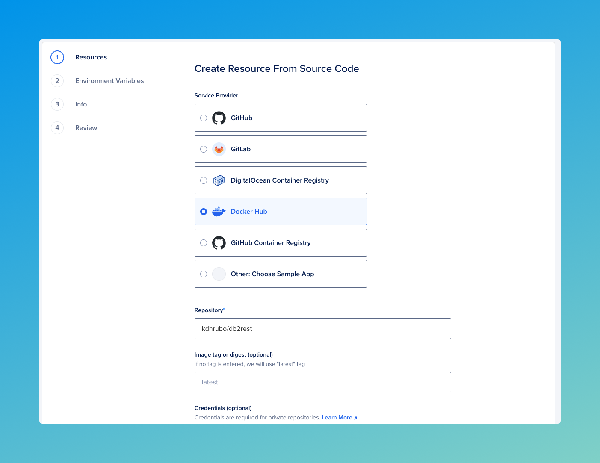
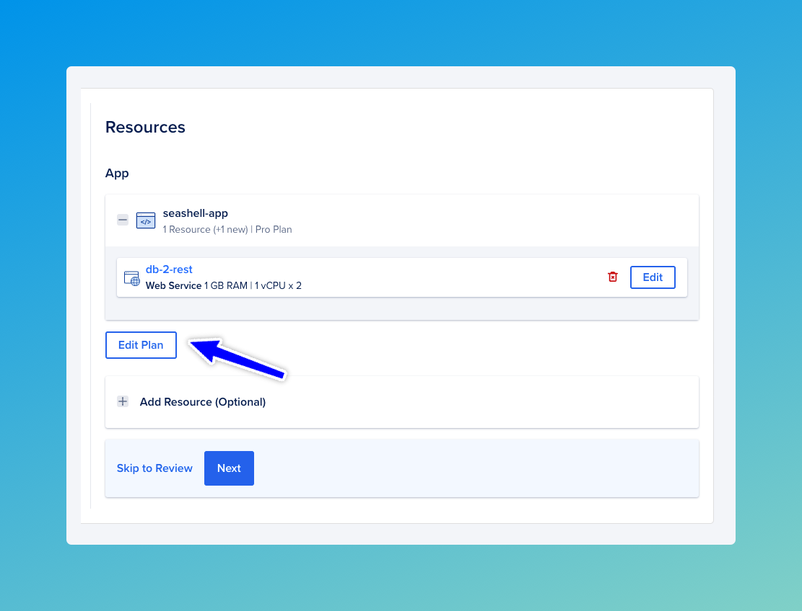
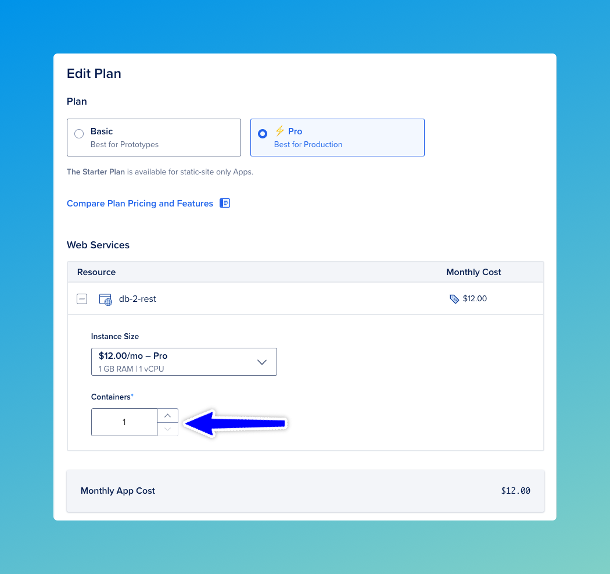
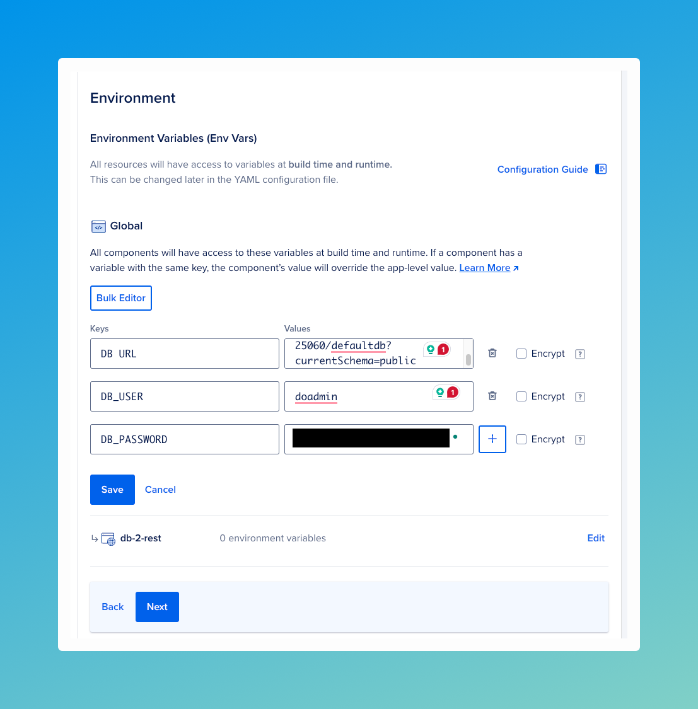
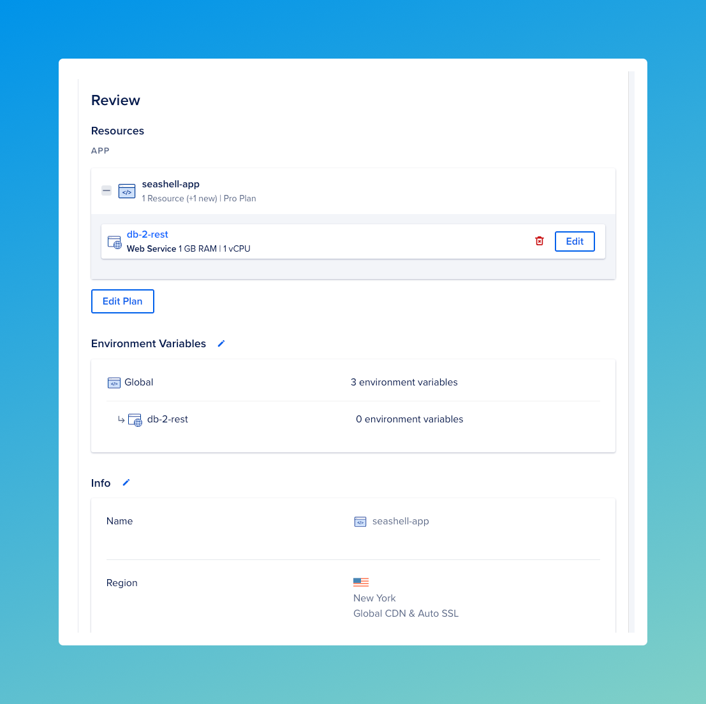
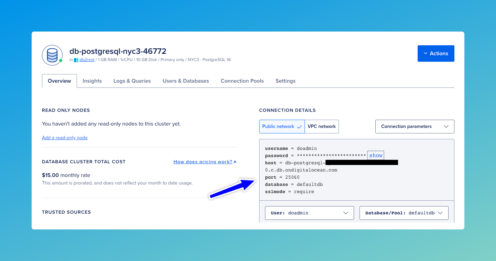
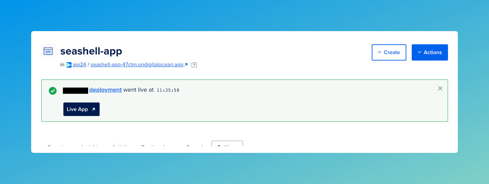

# Run on App Platform


It is easy to run DB2Rest on [DigitalOcean App Platform](https://www.digitalocean.com/products/app-platform) using the Docker image.
It is also possible to run DB2Rest on [droplets](https://www.digitalocean.com/products/droplets) or virtual machines(VM).

# DigitalOcean managed database

[DigitalOcean](https://www.digitalocean.com/) provides managed database service for :
    - PostgreSQL
    - MySQL
    - MongoDB
    - Redis

DB2Rest currently supports `PostgreSQL` and `MySQL`.


## Create database

Follow the tutorials below to launch either `PostgreSQL` or `MySQL` database service.

 - [PostgreSQL Quickstart](https://docs.digitalocean.com/products/databases/postgresql/getting-started/quickstart/).
 - [MySQL Quickstart](https://docs.digitalocean.com/products/databases/mysql/getting-started/quickstart/).

The example below shows the dashboard of a managed PostgreSQL database created on DigitalOcean cloud.




## Create app service

DB2Rest can now be deployed as an app service and connect to the database created in the previous step.
In order to get started, click on any of the buttons as shown in the image below:



This will open the `Create App` form.


In this form set the values as listed below.
    1. Service Provider - Select `Docker Hub`
    2. Repository - kdhrubo/db2rest



Click on the `Next` button to load the `Resources` form.




Now click on `Edit Plan` button to set the number of `Containers` to 1 to reduce cost.



Click on `Back` to go back to the `Resources` form. Then click `Next`.

In the `Environment` screen, set the values for the following environment variables:

    - DB_URL
    - DB_USER
    - DB_PASSWORD



Click on `Save` to save the environment variables. Then click on the `Next` button twice to reach the `Review` page.



On the `Review` page, click on `Create Resources` to provision DB2Rest as an app service.

:::tip

The values needed for the environment are available in the database dashboard.

:::





## Test DB2Rest App Service

Once the deployment is successfully completed, it is time to test the application service.





### Check DB2Rest Health

It is very easy to verify DB2Rest application service with the actuator endpoint as shown below:

<Tabs>
    <TabItem value="cURL" label="cURL" default>
        ```bash

        curl --request GET \
        --url 'https://seashell-app-47ctm.ondigitalocean.app/actuator/health?=' \
        --header 'User-Agent: insomnia/8.6.1'


        ```
    </TabItem>
    <TabItem value="httpie" label="HTTPie">
        ```bash

        http GET 'https://seashell-app-47ctm.ondigitalocean.app/actuator/health?=' \
        User-Agent:insomnia/8.6.1

        ```
    </TabItem>


</Tabs>


The actuator health check service in DB2Rest will return the following response:


```http
HTTP/1.1 200
Content-Type: application/json
Transfer-Encoding: chunked

{
	"status": "UP",
	"groups": [
		"liveness",
		"readiness"
	]
}

```

The `status` attribute shows that, the application service is ready to handle database operations.


### Create Table

Next, create a table using any database tool. Our favorite tool is [Dbeaver](https://dbeaver.io/).

```SQL

CREATE TABLE employee (
	id serial4 NOT NULL,
	first_name varchar(50) NOT NULL,
	last_name varchar(50) NOT NULL,
	email varchar(255) NOT NULL,
	created_on timestamp NOT NULL,
	CONSTRAINT employee_email_key UNIQUE (email),
	CONSTRAINT employee_pkey PRIMARY KEY (id)
);

```
