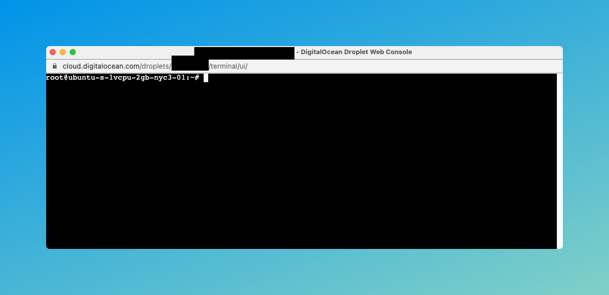
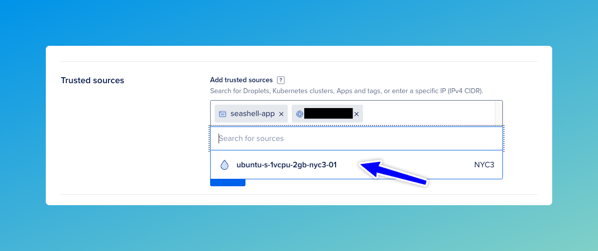

# Run on Droplet

Droplets are linux based virtual machines provided by DigitalOcean. Follow the instructions
[here](https://docs.digitalocean.com/products/droplets/getting-started/quickstart) to launch an Ubuntu based droplet.


:::tip

The droplet should be created in the same DigitalOcean region in which the database has been created.

:::



## Install Java 21

DB2Rest requires Java 21 to run. It makes use of virtual threads allowing very high scaling with minimal resources.
Installing Java 21 on Ubuntu Droplet is very easy and only takes a single command

```Shell
$ apt install openjdk-21-jre-headless
```

Jav 21 runtime will be installed within few seconds.

### Verify JRE

Run the command below to verify that Java Runtime 21 has been successfully installed.

```Shell
$ java -version
```


## Get DB2Rest

Next download DB2Rest using the following command:

```Shell
$ wget https://download.db2rest.com/db2rest-0.2.2-RC3.jar
```

In order to make the downloaded jar executable run the command below:

```Shell
$ chmod +x db2rest-0.2.2-RC3.jar
```


## Enable Droplet IP on Database Firewall

The droplet IP address must be enabled on the database firewall/trusted sources. Otherwise, it will not be able to connect to the
database. Go to the dashboard of the database created in the [previous tutorial](
https://db2rest.com/docs/digitalocean/run-on-app-platform#create-database) and then in the `Settings` tab.

Click on `Edit` in the `Trusted Sources` section.




## Run DB2Rest


## Test DB2Rest


## Query using DB2Rest


