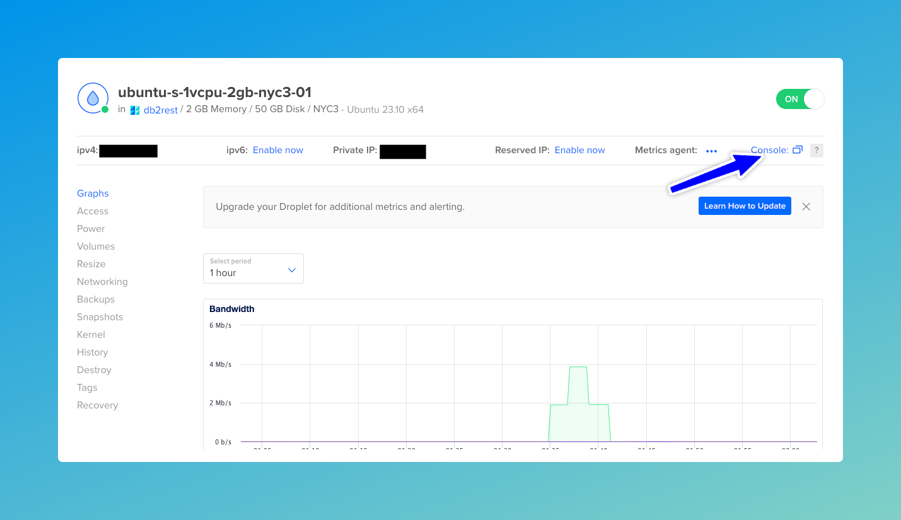
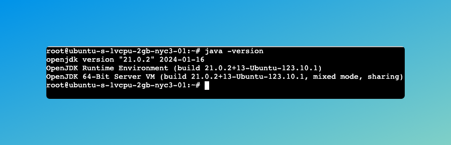
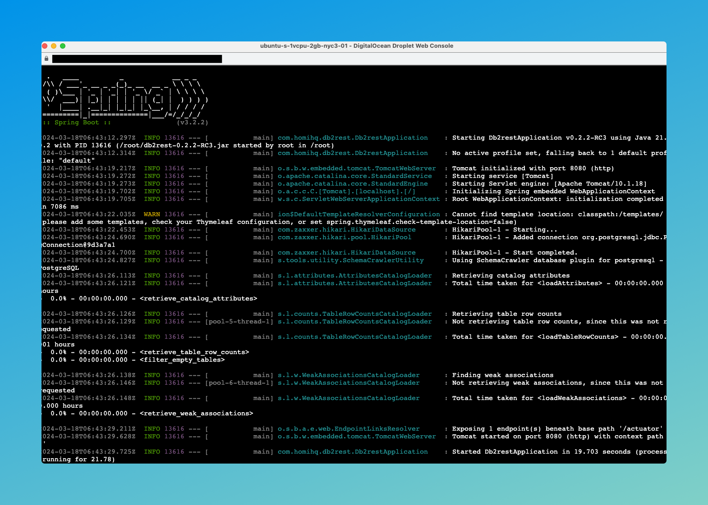

# Run on Droplet

Droplets are linux based virtual machines provided by DigitalOcean. Follow the instructions
[here](https://docs.digitalocean.com/products/droplets/getting-started/quickstart) to launch an Ubuntu based droplet.


:::tip

The droplet should be created in the same DigitalOcean region in which the database has been created.

:::

## Launch Droplet Console

From the droplet dashboard, click on `console` to connect to the droplet from the browser.




## Install Java 21

DB2Rest requires Java 21 to run. It makes use of virtual threads allowing very high scaling with minimal resources.
Installing Java 21 on Ubuntu Droplet is very easy and only takes a single command

```Shell
$ apt install openjdk-21-jre-headless
```

Jav 21 runtime will be installed within few seconds.

### Verify JRE

Run the command below to verify that Java Runtime 21 has been successfully installed.

```Shell
$ java -version
```
This will print the Java version as shown below:



## Download DB2Rest

Next download DB2Rest using the following command:

```Shell
$ wget https://download.db2rest.com/db2rest-0.2.2-RC3.jar
```

In order to make the downloaded jar executable run the command below:

```Shell
$ chmod +x db2rest-0.2.2-RC3.jar
```


## Enable Droplet IP on Database Firewall

The droplet IP address must be enabled on the database firewall/trusted sources. Otherwise, it will not be able to connect to the
database. Go to the dashboard of the database created in the [previous tutorial](
https://db2rest.com/docs/digitalocean/run-on-app-platform#create-database) and then in the `Settings` tab.

Click on `Edit` in the `Trusted Sources` section. Then select the droplet from the drop-down and click 'Save'.


## Run DB2Rest

Finally, it's time to launch DB2Rest on the droplet. Set the environment variables as shown below:

```Shell
$ export DB_URL=jdbc:postgresql://[DB_HOST]:[DB_PORT]/[DB_NAME]?currentSchema=public

$ export DB_USER=doadmin

$ export DB_PASSWORD=[DB_PASSWORD]


```

:::tip

The values of the variables are available in the database console.

:::

Finally, run DB2Rest with the following command

```Shell
$ java -jar db2rest-0.2.2-RC3.jar

```



DB2Rest is started in few seconds and APIs are ready.

## Test DB2Rest

import Tabs from '@theme/Tabs';
import TabItem from '@theme/TabItem';

<Tabs>
    <TabItem value="cURL" label="cURL" default>
        ```bash

        curl --request GET \
        --url http://[DROPLET_IP]:8080/actuator/health \
        --header 'User-Agent: insomnia/8.6.1'


        ```
    </TabItem>
    <TabItem value="httpie" label="HTTPie">
        ```bash

        http GET http://[DROPLET_IP]:8080/actuator/health \
        User-Agent:insomnia/8.6.1

        ```
    </TabItem>

</Tabs>


The actuator health check service in DB2Rest will return the following response:


```http
HTTP/1.1 200
Content-Type: application/json
Transfer-Encoding: chunked

{
	"status": "UP"
}

```

:::info

The response is slightly different from when, DB2Rest runs in a container platform like DigitalOcean App platform.

:::

## Query using DB2Rest


<Tabs>
    <TabItem value="cURL" label="cURL" default>
        ```bash

        curl --request GET \
        --url http://[DROPLET_IP]:8080/employee \
        --header 'User-Agent: insomnia/8.6.1'


        ```
    </TabItem>
    <TabItem value="httpie" label="HTTPie">
        ```bash

        http GET http://[DROPLET_IP]:8080/employee \
        User-Agent:insomnia/8.6.1

        ```
    </TabItem>

</Tabs>

The response is:

```http
HTTP/1.1 200
Content-Type: application/json
Transfer-Encoding: chunked

[
	{
		"id": 1,
		"first_name": "Salman",
		"last_name": "Khan",
		"email": "sk@skfilms.com",
		"created_on": "2015-04-14T11:07:36.639+00:00"
	}
]

```

## Security

The steps above uses `root` user. In a production grade set up a different user with lesser privileges should be used.
The DB2Rest jar should be copied in a folder like `/opt`.
