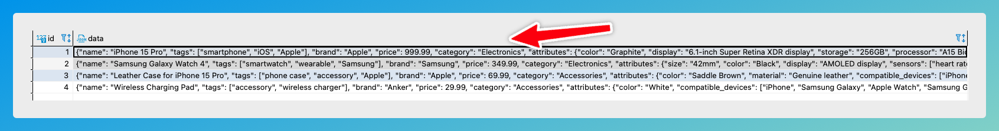

# Filter JSON Column Values

DB2Rest supports applying filter on JSON or JSONB columns of `PostgreSQL` database. For this DB2Rest has extended the RSQL operator list
to add JSON specific operators.

import Tabs from '@theme/Tabs';
import TabItem from '@theme/TabItem';

## `jbe`

The `jbe` operator performs an equality check on a certain attribute. Lets retrieve all the products where brand is `Apple`.

<Tabs>
    <TabItem value="cURL" label="cURL" default>
        ```bash

        curl --request GET \
        --url 'http://localhost:8080/v1/rdbms/pgdb/products?fields=id, data->>'name':name,data->>'price':price&filter=data**brand=jbe=Apple' \
        --header 'User-Agent: insomnia/9.2.0'


        ```
    </TabItem>
    <TabItem value="httpie" label="HTTPie">
        ```bash

        http GET 'http://localhost:8080/v1/rdbms/pgdb/products?fields=id, data->>'name':name,data->>'price':price&filter=data**brand=jbe=Apple' \
        User-Agent:insomnia/9.2.0

        ```
    </TabItem>

</Tabs>


The query above returns the following result:

```http
[
	{
		"id": 1,
		"name": "iPhone 15 Pro",
		"price": "999.99"
	},
	{
		"id": 3,
		"name": "Leather Case for iPhone 15 Pro",
		"price": "69.99"
	}
]

```


## `jsonbContain`

This filter operator checks if a JSON document contains another JSON document.




The following DB2Rest query will retrieve products where category is `Electronics`.

<Tabs>
    <TabItem value="cURL" label="cURL" default>
        ```bash

        curl --request GET \
        --url 'http://localhost:8080/v1/rdbms/pgdb/products?fields=id, data->>'name':product_name&filter=data=jsonbContain='{"category": "Electronics"}' \
        --header 'User-Agent: insomnia/9.2.0'


        ```
    </TabItem>
    <TabItem value="httpie" label="HTTPie">
        ```bash

        http GET 'http://localhost:8080/v1/rdbms/pgdb/products?fields=id, data->>'name':product_name&filter=data=jsonbContain='{"category": "Electronics"}' \
        User-Agent:insomnia/9.2.0

        ```
    </TabItem>

</Tabs>


The query above returns the following result:

```http
[
	{
		"id": 1,
		"product_name": "iPhone 15 Pro"
	},
	{
		"id": 2,
		"product_name": "Samsung Galaxy Watch 4"
	}
]

```

## `jsonContain`

Now let us retrieve the product whose price is 999.99

<Tabs>
    <TabItem value="cURL" label="cURL" default>
        ```bash

        curl --request GET \
        --url 'http://localhost:8080/v1/rdbms/pgdb/products?fields=id, data->>'name':name,data->>'price':price&filter=data=jsonContain='{"price": 999.99}' \
        --header 'User-Agent: insomnia/9.2.0'


        ```
    </TabItem>
    <TabItem value="httpie" label="HTTPie">
        ```bash

        http GET 'http://localhost:8080/v1/rdbms/pgdb/products?fields=id, data->>'name':name,data->>'price':price&filter=data=jsonContain='{"price": 999.99}' \
        User-Agent:insomnia/9.2.0

        ```
    </TabItem>

</Tabs>

The result is shown below:

````json lines

[
	{
		"id": 1,
		"name": "iPhone 15 Pro",
		"price": "999.99"
	}
]

````
