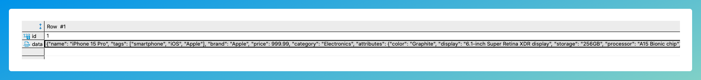

# JSON Column Selection

DB2Rest supports retrieving values from JSON or JSONB columns of `PostgreSQL` database.

import Tabs from '@theme/Tabs';
import TabItem from '@theme/TabItem';

## '->' Operator

Consider the following `products` table definition.

```sql
    CREATE TABLE "products" (
    id int4 NOT NULL DEFAULT nextval('products_id_seq'::regclass),
    "data" jsonb NULL,
    CONSTRAINT products_pkey PRIMARY KEY (id)
    );
```

The `data` column in this table contains all the details about the product, including its name. This is shown in the sample data below.




The following DB2Rest query will fetch the `name` attribute of the product.

<Tabs>
    <TabItem value="cURL" label="cURL" default>
        ```bash

        curl --request GET \
        --url 'http://localhost:8080/v1/rdbms/pgdb/products?fields=data->'name':product_name \
        --header 'User-Agent: insomnia/9.2.0'


        ```
    </TabItem>
    <TabItem value="httpie" label="HTTPie">
        ```bash

        http GET 'http://localhost:8080/v1/rdbms/pgdb/products?fields=data->'name':product_name \
        User-Agent:insomnia/9.2.0

        ```
    </TabItem>

</Tabs>

:::warning

`pgdb` is the id of the database set in the configuration of DB2REST. If not set then, the default value is `db`.

:::


The query above returns the following result:

```http
[
	{
		"product_name": "iPhone 15 Pro"
	},
	{
		"product_name": "Samsung Galaxy Watch 4"
	},
	{
		"product_name": "Leather Case for iPhone 15 Pro"
	},
	{
		"product_name": "Wireless Charging Pad"
	}
]

```

