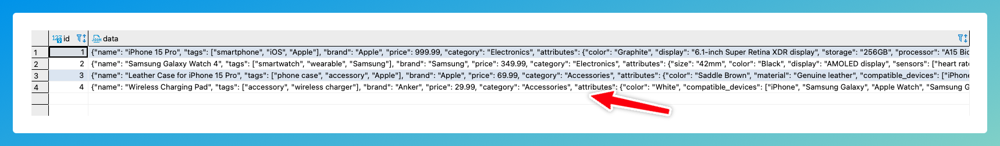

# Select JSON Column Values

DB2Rest supports retrieving values from JSON or JSONB columns of `PostgreSQL` database.

import Tabs from '@theme/Tabs';
import TabItem from '@theme/TabItem';

## `->` Operator

Consider the following `products` table definition.

```sql
    CREATE TABLE "products" (
    id int4 NOT NULL DEFAULT nextval('products_id_seq'::regclass),
    "data" jsonb NULL,
    CONSTRAINT products_pkey PRIMARY KEY (id)
    );
```

The `data` column in this table contains all the details about the product, including its name. This is shown in the sample data below.


The following DB2Rest query will fetch the `name` attribute of the product.

<Tabs>
    <TabItem value="cURL" label="cURL" default>
        ```bash

        curl --request GET \
        --url 'http://localhost:8080/v1/rdbms/pgdb/products?fields=data->'name':product_name \
        --header 'User-Agent: insomnia/9.2.0'


        ```
    </TabItem>
    <TabItem value="httpie" label="HTTPie">
        ```bash

        http GET 'http://localhost:8080/v1/rdbms/pgdb/products?fields=data->'name':product_name \
        User-Agent:insomnia/9.2.0

        ```
    </TabItem>

</Tabs>

:::warning

`pgdb` is the id of the database set in the configuration of DB2REST. If not set then, the default value is `db`.

:::


The query above returns the following result:

```http
[
	{
		"product_name": "iPhone 15 Pro"
	},
	{
		"product_name": "Samsung Galaxy Watch 4"
	},
	{
		"product_name": "Leather Case for iPhone 15 Pro"
	},
	{
		"product_name": "Wireless Charging Pad"
	}
]

```

## `->>` Operator

The `->>` operator is also supported as shown below:


<Tabs>
    <TabItem value="cURL" label="cURL" default>
        ```bash

        curl --request GET \
        --url 'http://localhost:8080/v1/rdbms/pgdb/products?fields=data->>'name':product_name \
        --header 'User-Agent: insomnia/9.2.0'


        ```
    </TabItem>
    <TabItem value="httpie" label="HTTPie">
        ```bash

        http GET 'http://localhost:8080/v1/rdbms/pgdb/products?fields=data->>'name':product_name \
        User-Agent:insomnia/9.2.0

        ```
    </TabItem>

</Tabs>


This will also return the same result as above.

## `#>` Operator

This operator extracts a JSON sub-object at a specified path. The query below retrieves the `attributes`.



<Tabs>
    <TabItem value="cURL" label="cURL" default>
        ```bash

        curl --request GET \
        --url 'http://localhost:8080/v1/rdbms/pgdb/products?fields=data%23>'{attributes}':attributes \
        --header 'User-Agent: insomnia/9.2.0'


        ```
    </TabItem>
    <TabItem value="httpie" label="HTTPie">
        ```bash

        http GET 'http://localhost:8080/v1/rdbms/pgdb/products?fields=data%23>'{attributes}':attributes \
        User-Agent:insomnia/9.2.0

        ```
    </TabItem>

</Tabs>


:::tip

The `#>` operator has to be escaped in the URL.

:::

The result is shown below.

```http
[
	{
		"attributes": {
			"color": "Graphite",
			"display": "6.1-inch Super Retina XDR display",
			"storage": "256GB",
			"processor": "A15 Bionic chip"
		}
	},
	{
		"attributes": {
			"size": "42mm",
			"color": "Black",
			"display": "AMOLED display",
			"sensors": [
				"heart rate monitor",
				"ECG",
				"SpO2"
			]
		}
	},
	{
		"attributes": {
			"color": "Saddle Brown",
			"material": "Genuine leather",
			"compatible_devices": [
				"iPhone 15 Pro",
				"iPhone 15 Pro Max"
			]
		}
	},
	{
		"attributes": {
			"color": "White",
			"compatible_devices": [
				"iPhone",
				"Samsung Galaxy",
				"Apple Watch",
				"Samsung Galaxy Watch"
			]
		}
	}
]

```

It is also possible to retrieve specific attribute using the `#>` operator as shown in the next query.


<Tabs>
    <TabItem value="cURL" label="cURL" default>
        ```bash

        curl --request GET \
        --url 'http://localhost:8080/v1/rdbms/pgdb/products?fields=data%23>'{attributes.color}':colors \
        --header 'User-Agent: insomnia/9.2.0'


        ```
    </TabItem>
    <TabItem value="httpie" label="HTTPie">
        ```bash

        http GET 'http://localhost:8080/v1/rdbms/pgdb/products?fields=data%23>'{attributes.color}':colors \
        User-Agent:insomnia/9.2.0

        ```
    </TabItem>

</Tabs>


The result is shown below.

```http
[
	{
		"colors": "Graphite"
	},
	{
		"colors": "Black"
	},
	{
		"colors": "Saddle Brown"
	},
	{
		"colors": "White"
	}
]

```

## `#>>` Operator

The `#>>` operator can also be used to retrieve specific attribute value.


<Tabs>
    <TabItem value="cURL" label="cURL" default>
        ```bash

        curl --request GET \
        --url 'http://localhost:8080/v1/rdbms/pgdb/products?fields=data%23>>'{attributes.color}':colors \
        --header 'User-Agent: insomnia/9.2.0'


        ```
    </TabItem>
    <TabItem value="httpie" label="HTTPie">
        ```bash

        http GET 'http://localhost:8080/v1/rdbms/pgdb/products?fields=data%23>>'{attributes.color}':colors \
        User-Agent:insomnia/9.2.0

        ```
    </TabItem>

</Tabs>


The result is shown below.

```http
[
	{
		"colors": "Graphite"
	},
	{
		"colors": "Black"
	},
	{
		"colors": "Saddle Brown"
	},
	{
		"colors": "White"
	}
]

```
