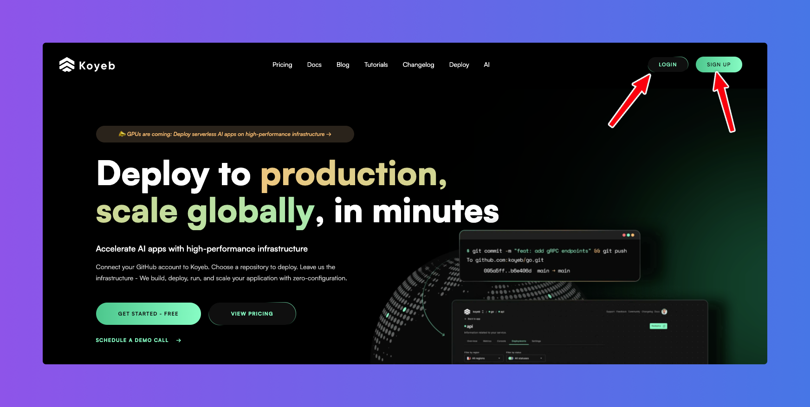
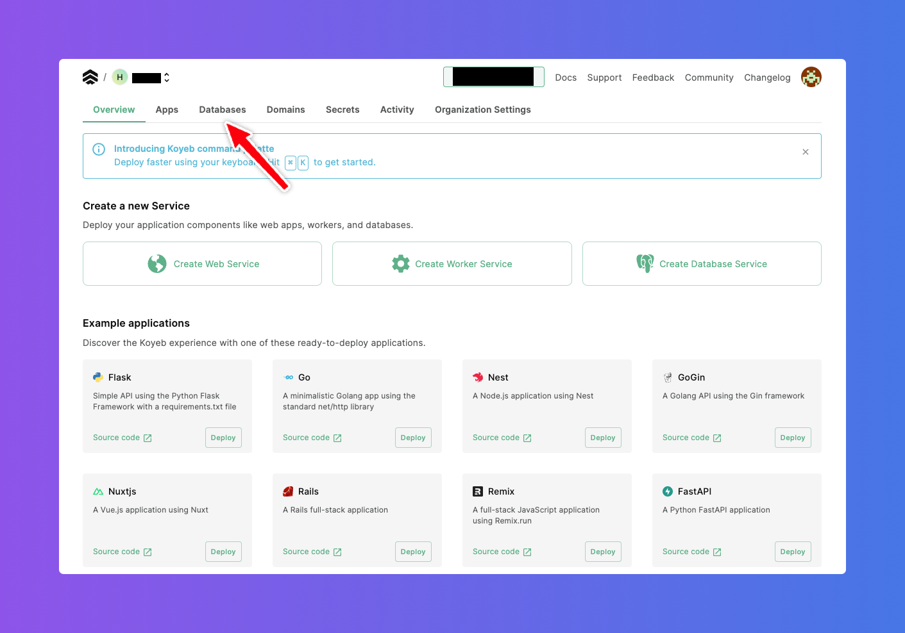
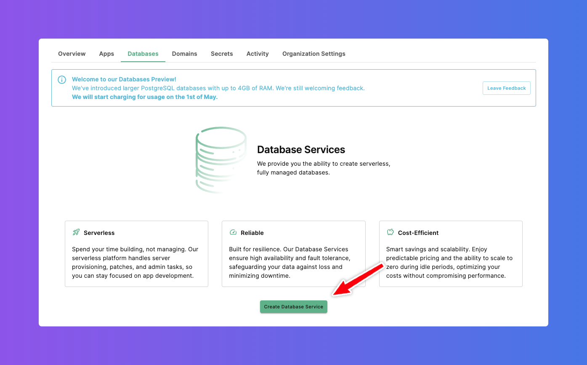
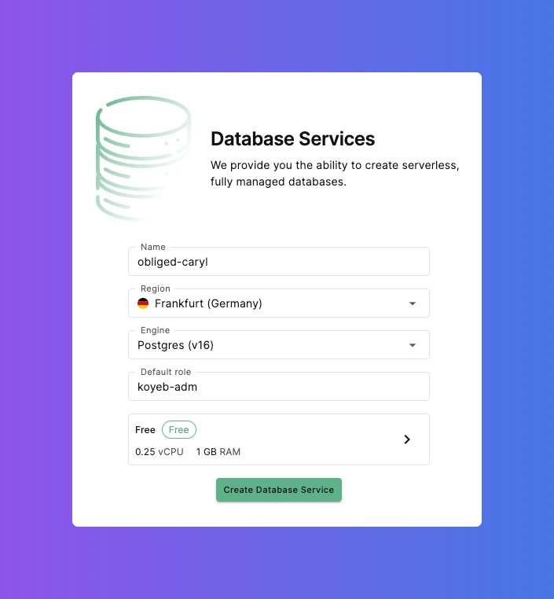
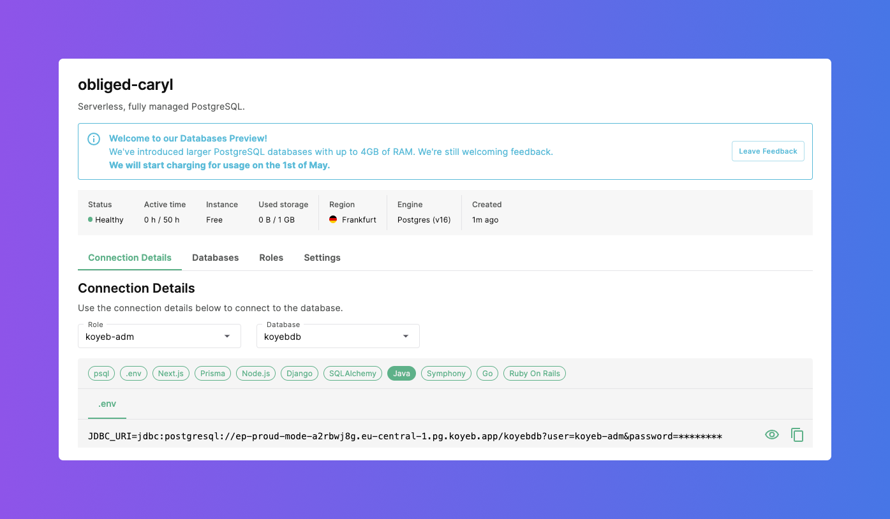
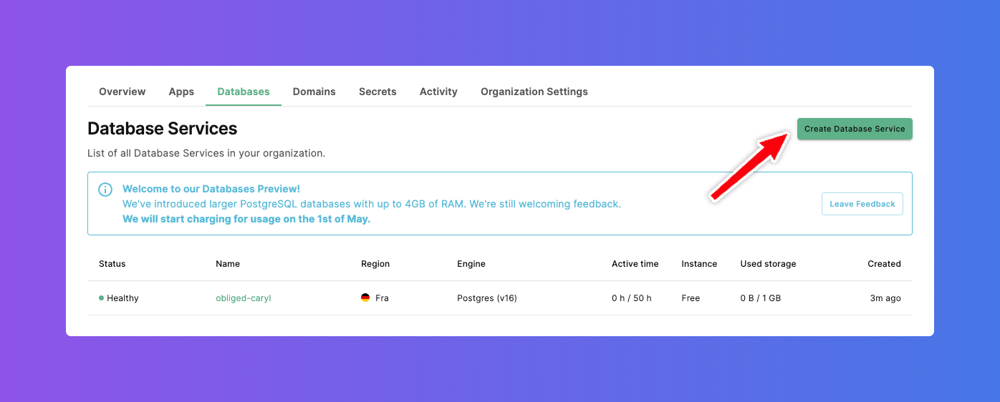

# Create Database on Koyeb

[Koyeb](https://www.koyeb.com/) is a developer-friendly serverless platform to deploy apps globally. No-ops, servers, and infrastructure management.
Koyeb provides serverless PostGreSQL database service. In order to create a database signup on Koyeb from the home page.In case you already have an
account login to Koyeb to access the control panel.

On the Koyeb dashboard click on the `Databases` tab.

Now on the `Database` dashboard page , click on `Create Database Service` button.

Following fields can be updated as per your needs
- Name
- Engine
- Default role
- Compute and Memory

For example - in this case, only defaults are used. Finally click on `Create Database Service` button.

Within a few seconds the serverless PostgreSQL is up and running as shown below:

The list of databases on Koyeb are shown below:

