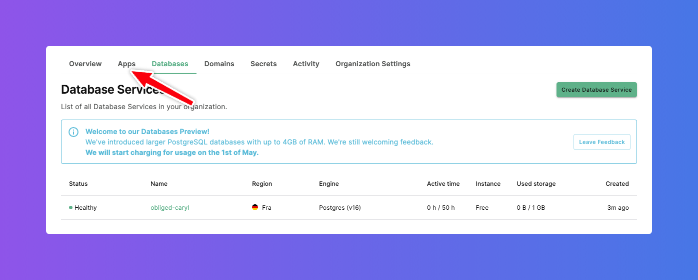

# Run DB2Rest as Koyeb Web Service

# What is a Koyeb Service ?

Koyeb service is an application that can run as a web application, API accessible publicly over internet or private like a background worker.
Services can part of a microservices application or a single monolithic application.
The platform makes it easy to deploy such service from Git repositories or using a Docker image. For more information on Koyeb service refer
to this [link.](https://www.koyeb.com/docs/reference/services)

:::tip

It is very easy to auto-scale a service on Koyeb. Reference is below:

[Koyeb Autocaling reference](https://www.koyeb.com/docs/run-and-scale/autoscaling)

:::

## Create Koyeb App

In order to create Koyeb App, click on the `Apps` tab.

On the `Apps` dashboard click on `Create App` button.

This will show the `Deploy a new project on Koyeb` page.

## Deploy a new project

On the `Deploy a project on Koyeb` page there are options to:

- Github : deploy from a Github repository.
- Docker : deploy from a Docker image.

### Select Deployment method

DB2Rest provides a [public docker image](https://hub.docker.com/repository/docker/kdhrubo/db2rest). This can be used to deploy as Koyeb service. Hence, select `Docker` as the deployment method.

### Docker Image

Now on the `Docker image`, page provide path to the DB2Rest docker image and click on `Next`.

:::info[DB2Rest Public Docker Image]

docker.io/kdhrubo/db2rest:latest

:::

This will show the `Configure service and deploy` screen. On this screen some configuration needs to be edited as described in the next sections.

### Environment Variables

