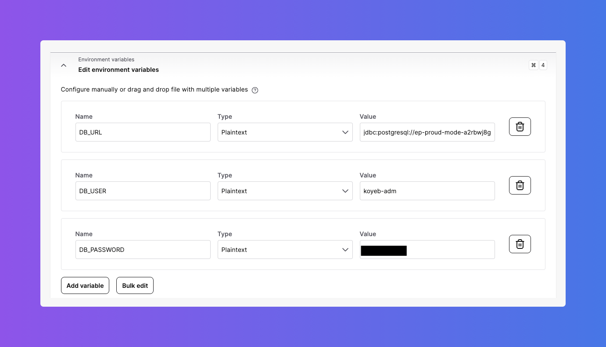
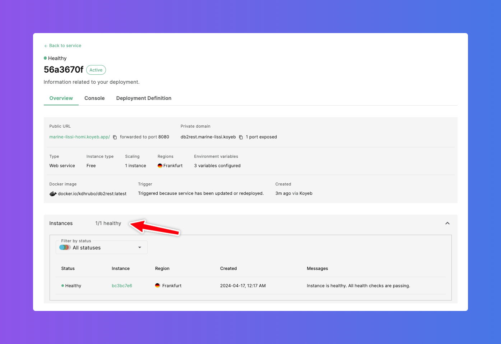

# Run DB2Rest as Koyeb Web Service

# What is a Koyeb Service ?

Koyeb service is an application that can run as a web application, API accessible publicly over internet or private like a background worker.
Services can part of a microservices application or a single monolithic application.
The platform makes it easy to deploy such service from Git repositories or using a Docker image. For more information on Koyeb service refer
to this [link.](https://www.koyeb.com/docs/reference/services)

:::tip

It is very easy to auto-scale a service on Koyeb. Reference is below:

[Koyeb Autocaling reference](https://www.koyeb.com/docs/run-and-scale/autoscaling)

:::

## Create Koyeb App

In order to create Koyeb App, click on the `Apps` tab.

On the `Apps` dashboard click on `Create App` button.

This will show the `Deploy a new project on Koyeb` page.

## Deploy a new project

On the `Deploy a project on Koyeb` page there are options to:

- Github : deploy from a Github repository.
- Docker : deploy from a Docker image.

### Select Deployment method

DB2Rest provides a [public docker image](https://hub.docker.com/repository/docker/kdhrubo/db2rest). This can be used to deploy as Koyeb service. Hence, select `Docker` as the deployment method.

### Docker Image

Now on the `Docker image`, page provide path to the DB2Rest docker image and click on `Next`.

:::info[DB2Rest Public Docker Image]

docker.io/kdhrubo/db2rest:latest

:::

This will show the `Configure service and deploy` screen. On this screen some configuration needs to be edited as described in the next sections.

### Environment Variables

The following environment variables are required:

- DB_URL
- DB_USER
- DB_PASSWORD

These values are available from the connection details tab (Java tab) as shown below.

The environment variables can be configured as shown below. All the values are set as type `Plaintext`.

### Regions

In this case the service is going to be deployed in the `Frankfurt` region. The [DB2Rest](https://db2rest.com) service should be deployed
in the same region as the database.

### Instance

In this example a free instance is selected for demonstration. Expand this section and select compute, memory and disk capacity appropriate for
your deployment.

### Scaling

Change the number of instances to suit your application needs.

:::warning

As of writing this article, Koyeb does not support scale to zero.

:::

### Exposed Ports

In this case the port `8080` is selected (instead of default `8000`). However, multiple ports can be selected (including remote debugging port) for the application service.

### Health checks

The health check configuration should be changed to point to the DB2Rest actuator end point for health status check as shown below.

### App and Service names

The app and service names can be changed, however in this case default values are applied.

Finally click on the `Deploy` button on the top of the section.

### Deployment Status

On successful deployment, healthy instance shows up.

### Logs & Events

The deployment logs can be reviewed to verify successful deployment.

Key things to note in the log are:

- All health checks are passing and instance is ready to process requests.
- DB2Rest is successfully started and actuator is available.
- DB2Rest is connected to the database and has successfully loaded the meta-data about the `employee` table created in the
[Create Database on Koyeb](https://db2rest.com/docs/koyeb/create-database-on-koyeb) guide.
