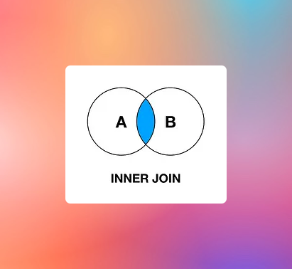
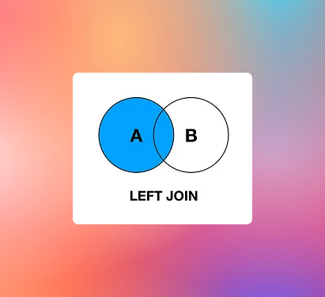
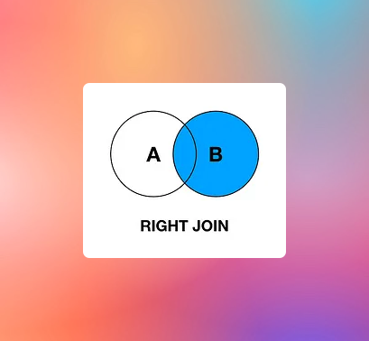

# How to Join Multiple Tables?

When data is stored in a single table, it is very easy to retrieve rows and apply filter.
However, for real world applications data is stored in multiple tables. In order to retrieve data from multiple tables
`join` SQL command can be used.
DB2Rest builds on its [RSQL](https://db2rest.com/docs/read/introduction-to-rsql) core to make it very easy to join more than one table and fetch data.

## Types of Join

SQL JOIN types include:

    - INNER JOIN (also known as a ‘simple’ JOIN). This is the most common type of JOIN.
    - LEFT JOIN (or LEFT OUTER JOIN)
    - RIGHT JOIN (or RIGHT OUTER JOIN)
    - FULL JOIN (or FULL OUTER JOIN)
    - Self JOIN
    - Cross JOIN.

:::tip

The `JOIN` query is specified as HTTP `POST`.

:::

The key attributes of request body is described below:

| Sl# | Attribute | Mandatory | Description                                                                                         |
|-----|-----------|-----------|-----------------------------------------------------------------------------------------------------|
| 1   | table     | Y         | Table to join with the root table.                                                                  |
| 2   | fields    | N         | List of fields to retrieve from join tables                                                         |
| 3   | type      | N         | Type of join - allowed values - `INNER`, `LEFT`, `RIGHT`, `OUTER`, `CROSS`. Default value : `INNER` |
| 3   | on        | N         | Join columns.                                                                                       |


## Inner Join

`INNER JOIN` selects records that have matching values in both tables.



The example below shows how to join `review` table with `film` to retrieve all the reviews for each film.

import Tabs from '@theme/Tabs';
import TabItem from '@theme/TabItem';

<Tabs>
    <TabItem value="cURL" label="cURL" default>
        ```bash
        $ curl 'http://localhost:8080/review/_expand' -i -X POST \
        -H 'Content-Type: application/json' \
        -H 'Accept: application/json' \
        -d '[{"table":"film","fields":["title","release_year"],"type":"INNER","on":["film_id==film_id"]}]'
        ```
    </TabItem>
    <TabItem value="httpie" label="HTTPie">
        ```bash
        $ echo '[{"table":"film","fields":["title","release_year"],"type":"INNER","on":["film_id==film_id"]}]' | http POST 'http://localhost:8080/review/_expand' \
        'Content-Type:application/json' \
        'Accept:application/json'
        ```
    </TabItem>

</Tabs>


The response from this query is shown below.

```http
HTTP/1.1 200 OK
Content-Type: application/json
Content-Length: 174

[
    {
        "review_id":"ABC123",
        "message":"Awesome movie",
        "rating":4,
        "film_id":1,
        "last_update":"2024-03-10T08:20:59.000+00:00",
        "title":"ACADEMY DINOSAUR",
        "release_year":"2006-01-01"
    }
]


```


## Left Join


The `LEFT JOIN` keyword returns all records from the left table (A), and the matching records from the right table (B).
The result is 0 records from the right side, if there is no match.



<Tabs>
    <TabItem value="cURL" label="cURL" default>
        ```bash
        $ curl 'http://localhost:8080/users/_expand' -i -X POST \
        -H 'Content-Type: application/json' \
        -H 'Accept: application/json' \
        -d '[{"table":"userprofile","fields":["apid","auid","firstname","lastname","email","phone"],"type":"LEFT","on":["auid==auid"]}]'
        ```
    </TabItem>
    <TabItem value="httpie" label="HTTPie">
        ```bash
        $ echo '[{"table":"userprofile","fields":["apid","auid","firstname","lastname","email","phone"],"type":"LEFT","on":["auid==auid"]}]' | http POST 'http://localhost:8080/users/_expand' \
        'Content-Type:application/json' \
        'Accept:application/json'
        ```
    </TabItem>

</Tabs>

This will return the following result:

```http
HTTP/1.1 200 OK
Content-Type: application/json
Content-Length: 730


[
  {
    "auid": 1,
    "username": "admin",
    "password": "pswrd123",
    "createdate": "2024-03-10T00:00:00",
    "isActive": true,
    "apid": 1,
    "firstname": "Jack",
    "lastname": "Wolf",
    "email": "bettestroom@gmail.com",
    "phone": "600075764216"
  },
  {
    "auid": 2,
    "username": "admin1",
    "password": "pass506",
    "createdate": "2024-03-10T00:00:00",
    "isActive": true,
    "apid": null,
    "firstname": null,
    "lastname": null,
    "email": null,
    "phone": null
  },
  {
    "auid": 4,
    "username": "fox12",
    "password": "45@jgo0",
    "createdate": "2024-03-10T00:00:00",
    "isActive": true,
    "apid": null,
    "firstname": null,
    "lastname": null,
    "email": null,
    "phone": null
  },
  {
    "auid": 6,
    "username": "lexus1267",
    "password": "98hnfRT6",
    "createdate": "2024-03-10T00:00:00",
    "isActive": true,
    "apid": null,
    "firstname": null,
    "lastname": null,
    "email": null,
    "phone": null
  }
]

```

## Right Join


The `RIGHT JOIN` keyword returns all records from the right table (B), and the matching records from the left table (A).
The result is 0 records from the left side, if there is no match.




<Tabs>
    <TabItem value="cURL" label="cURL" default>
        ```bash
        $ curl 'http://localhost:8080/users/_expand' -i -X POST \
        -H 'Content-Type: application/json' \
        -H 'Accept: application/json' \
        -d '[{"table":"userprofile","fields":["apid","auid","firstname","lastname","email","phone"],"type":"RIGHT","on":["auid==auid"]}]'
        ```
    </TabItem>
    <TabItem value="httpie" label="HTTPie">
        ```bash
        $ echo '[{"table":"userprofile","fields":["apid","auid","firstname","lastname","email","phone"],"type":"RIGHT","on":["auid==auid"]}]' | http POST 'http://localhost:8080/users/_expand' \
        'Content-Type:application/json' \
        'Accept:application/json'
        ```
    </TabItem>

</Tabs>


This will return the following result:

```http
HTTP/1.1 200 OK
Content-Type: application/json
Content-Length: 741

    [
        {
            "auid":1,
            "username":"admin",
            "password":"pswrd123",
            "createdate":"2024-03-10T00:00:00",
            "isActive":true,
            "apid":1,
            "firstname":"Jack",
            "lastname":"Wolf",
            "email":"bettestroom@gmail.com",
            "phone":"600075764216"
        },
        {
            "auid":3,
            "username":null,
            "password":null,
            "createdate":null,
            "isActive":null,
            "apid":2,
            "firstname":"Tom",
            "lastname":"Collins",
            "email":"tnkc@outlook.com",
            "phone":"878511311054"
        },
        {
            "auid":5,
            "username":null,
            "password":null,
            "createdate":null,
            "isActive":null,
            "apid":4,
            "firstname":"Bill",
            "lastname":"Fonskin",
            "email":"bill_1290@gmail.com",
            "phone":"450985764216"
        },
        {
            "auid":7,
            "username":null,
            "password":null,
            "createdate":null,
            "isActive":null,
            "apid":7,
            "firstname":"Ivan",
            "lastname":"Levchenko",
            "email":"ivan_new@outlook.com",
            "phone":"878511311054"
        }
    ]
```

