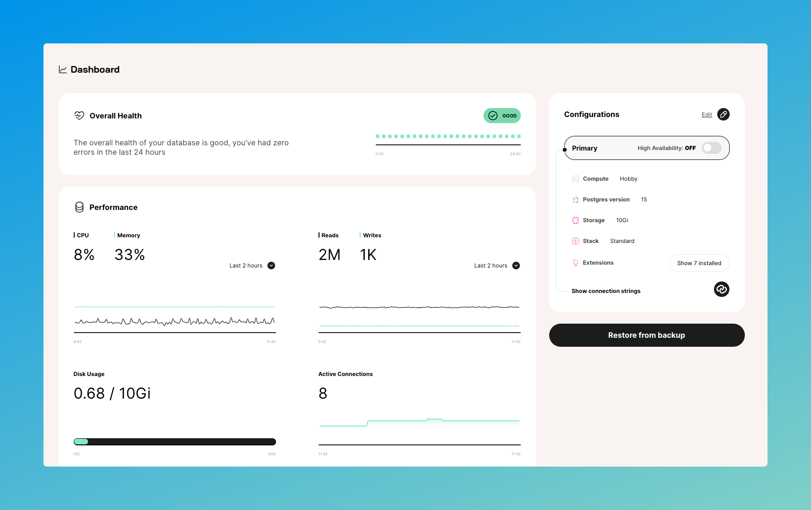
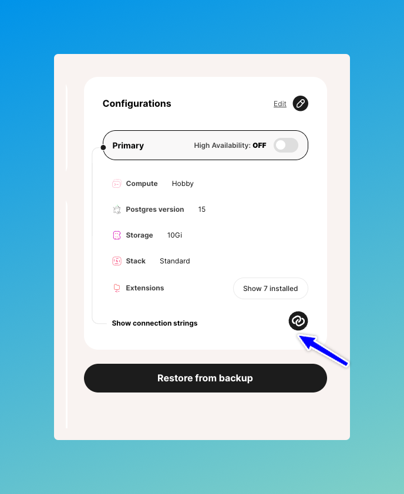
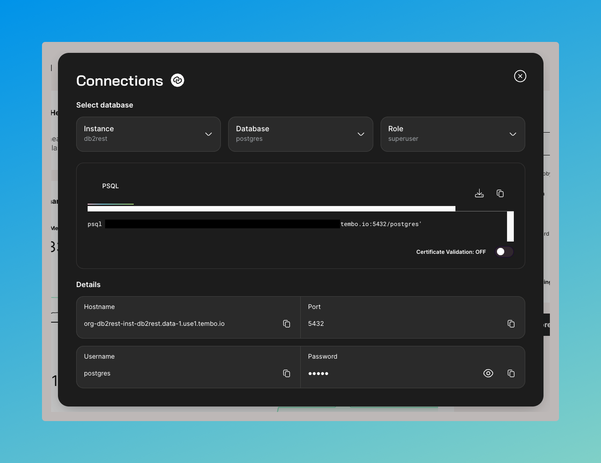
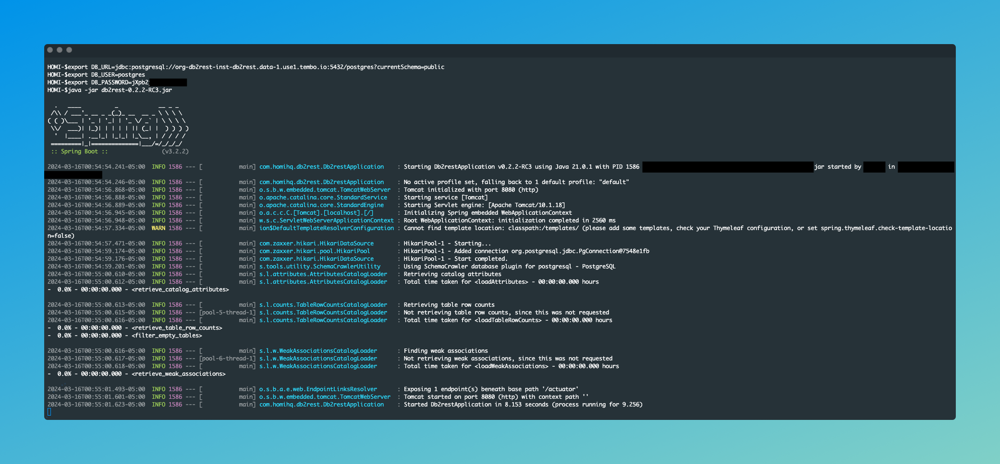

# Integrate with Tembo PostgreSQL


[Tembo](https://tembo.io/) serves as the premier developer platform tailored for crafting a wide array of data services within the Postgres environment.
By streamlining the database landscape, Tembo equips users with a high-performance, fully customizable managed Postgres service.
Utilizing Tembo, developers gain the ability to swiftly establish specialized
data services through Stacks, predefined Postgres configurations, and deploy seamlessly without the need for intricate builds or additional data teams.

This tutorial is a step by step guide to integrate DB2Rest with Tembo cloud.

## Create a PostgreSQL database on Tembo Cloud

Follow the [Tembo getting started](https://tembo.io/docs/tembo-cloud/getting_started) guide to signup, login and create a database instance on Tembo.
Once the database instance is created, it will show up in the dashboard.




### Get Connection Details

The connection details can be found in the panel on the right side of the Tembo dashboard.



Click on the connection string button and it will open the details in a new panel.




### Connect to Tembo with DB2Rest

Now open your terminal and run the command below to connect to Tembo from your local setup.

```Shell

$ export DB_URL=jdbc:postgresql://org-db2rest-inst-db2rest.data-1.use1.tembo.io:5432/postgres?currentSchema=public
$ export DB_USER=postgres
$ export DB_PASSWORD=<your password>
$ java -jar db2rest-0.2.2-RC3.jar

```




### Connect to Tembo with DB2Rest Docker Image

```Shell

$ export DB_URL=jdbc:postgresql://org-db2rest-inst-db2rest.data-1.use1.tembo.io:5432/postgres?currentSchema=public
$ export DB_USER=postgres
$ export DB_PASSWORD=jXpb2jmKkJRalkE9
$ docker run -p 8080:8080 -e DB_URL=${DB_URL}  -e DB_USER=${DB_USER}  -e DB_PASSWORD=${DB_PASSWORD}  kdhrubo/db2rest:latest

```

## Test Integration

Next, create a table using any database tool. Our favorite tool is [Dbeaver](https://dbeaver.io/).

```SQL

CREATE TABLE employee (
	id serial4 NOT NULL,
	first_name varchar(50) NOT NULL,
	last_name varchar(50) NOT NULL,
	email varchar(255) NOT NULL,
	created_on timestamp NOT NULL,
	CONSTRAINT employee_email_key UNIQUE (email),
	CONSTRAINT employee_pkey PRIMARY KEY (id)
);

```

### Create an employee

import Tabs from '@theme/Tabs';
import TabItem from '@theme/TabItem';

<Tabs>
    <TabItem value="cURL" label="cURL" default>
        ```bash
        curl --request POST \
        --url http://localhost:8080/employee \
        --header 'Content-Type: application/json' \
        --header 'User-Agent: insomnia/8.6.1' \
        --data '{

            "first_name" : "Salman",
            "last_name" : "Khan",
            "email" : "sk@skfilms.com",
            "created_on" : "2015-04-14T11:07:36.639Z"

        }'
        ```
    </TabItem>
    <TabItem value="httpie" label="HTTPie">
        ```bash
        echo '{

        "first_name" : "Salman",
        "last_name" : "Khan",
        "email" : "sk@skfilms.com",
        "created_on" : "2015-04-14T11:07:36.639Z"

    }' |  \
        http POST http://localhost:8080/employee \
        Content-Type:application/json \
        User-Agent:insomnia/8.6.1
        ```
    </TabItem>


</Tabs>

#### HTTP Response
```json lines
    {
      "row": 1,
      "keys": {
        "id": 3
      }
    }

```

